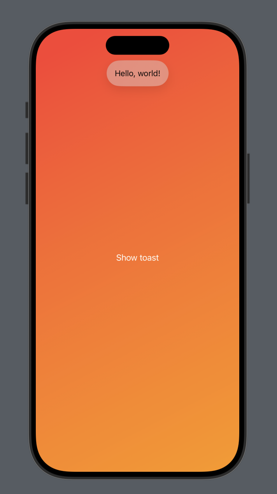

#  ToastyUI
## A lightweight SwiftUI toast message library

Add toast messages to your SwiftUI app with ease


## Usage

### Make a toast container

Apply the `toastContainer()` modifier on the root of your view hierarchy. 
Usually the best place for this is directly in your app, but it can go anywhere in 
your hierarchy. Important is to apply it to a view that is taking app the whole screen
so that your toast messages can appear in the right place

```swift
struct YourApp: App {
    var body: some Scene {
        WindowGroup {
            ContentView()
                .toastContainer()
        }
    }
} 
```

### Show a toast

Access the `showToast` environment value inside your view hierarchy. 
It takes a `Toast` object as argument and presents it on the screen.

#### Simple toast with message

```swift
showToast(Toast(message: "Hello, world!"))

// or shorthand

showToast("Hello, world!")
``` 

#### Toast with icon

```swift
showToast(Toast(icon: Image(systemNaned: "globe", message: "Hello, world!")))
```

#### Toast with type

```swift
showToast(Toast(type: .error, "My error"))
showToast(Toast(type: .warning, "My warning"))
showToast(Toast(type: .info, "My info")) // equals to Toast("My info")
```

Each toast type has a predefined icon and icon color. The default type is `info` 
and it shows no icon 
